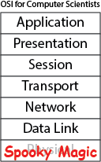

## Signal Processing for Computer Scientists
"Learn your signal processing on the street"
"A two-month long review article"

**Summer 2015, Tuesdays, 12:00-1:30, AMP Lab, 465H**

Signal processing was the original "big data" -- your cell phone
processes nearly 2TB of RF data daily. All the high-throughput
communications technologies we take for granted -- WiFi, gigabit
ethernet, 4G cellular, USB 3, home broadband, GPS -- are made possible
by advanced signal processing algorithms. Machine learning
technologies like deep learning have fundamental signal processing
operations (such as convolution) at their core. Yet most computer
scientists have at best a superficial understanding of these
technologies, the underlying mathematics, and how they can contribute.

The goal of this class is to develop an intuition for the basic
language of signal processing, to highlight some of the recent cool
advances, and to show how the emergence of programmable hardware (such
as software-defined radios) enable software engineers to do “signal
processing without the soldering”

## Topics:
* Complex and periodic signals. "What is phase?" Why do we always use
  complex signals? Analytic representations of real-valued data, the
  complex plane, the unit circle, a little bit of complex analysis
* Sampling theory -- discrete mathematics for signal
  processing. "Doing things on computers”, and the associated
  caveats. Sampling theory, resampling
* Spectral analysis. What is the relationship between the Fourier
  Transform, the Discrete-Time Fourier Transform, and the FFT? "Why
  does matlab’s FFT() always give me complex outputs?" forward,
  inverse transforms.
* Linear time-invariant systems -- filtering, spectral analysis,
  signal processing
* Nonlinearity -- modulation, communication, spread-spectrum
  technology, etc.
* Adaptive filtering, control, and learning from data
* image processing -- deconvolution, inpainting, deblurring,
  computational optics
* Time-space representations - STFT, wavelets, the Wigner transform

## Protocols and technologies
* Amplitude Modulation, Frequency Modulation, single-sideband, etc. 
* More modern modulation schemes like QAM for DTV 
* wired protocols and encodings : LVDS signalling, 8b/10B for gigabit ethernet, PCI express, and the like
* The classic phone system, modems, modern protocols like GSM  
* WiFi 
* GPS

## Background: 

I'm going to assume you've taken calculus and linear algebra and at
one point in your life have run matlab's `fft` and `ifft`. Examples
will all be in python and placed on github.

## Software Defined Radio

Software defined radio gives you a UDP interface to the entire radio
spectrum. The
[Ettus Research N210 Software Defined Radio](http://www.ettus.com/product/details/UN210-KIT)
has a bandwidth of DC-6GHz and can sample at 50 MSPS, broadcasting the
data over gigabit ethernet. That’s right, you open a UDP socket and
you’re measuring the electromagnetic spectrum!  I’ll be using this
hardware to capture sections of the RF Spectrum for analysis and
demonstrations.

## Schedule
* **June 9**: Overview, analytic functions, continuous-time and
  discrete-time signals, linear time-invariant systems, convolution
* **June 16**: The Fourier transform, the discrete-time Fourier transform,
  the discrete Fourier transform, and the fast Fourier transform.
* ~~June 23~~: [No class, Eric traveling] 
* **June 30**: The basics of sampling theory, modulation, AM and
  FM. Introduction to SDR.
* **July 7**: Time-space representations -- Uncertainty relations, the
  short-time fourier transform, wavelets, the wigner distribution
* **July 14**: Applications: spread-spectrum technology, WiFi, GPS
* **July 21**: Applications: Adaptive filtering, internet broadband, a
  little control theory
* **July 28**: Applications: Deconvolution, image processing, sparse methods 
